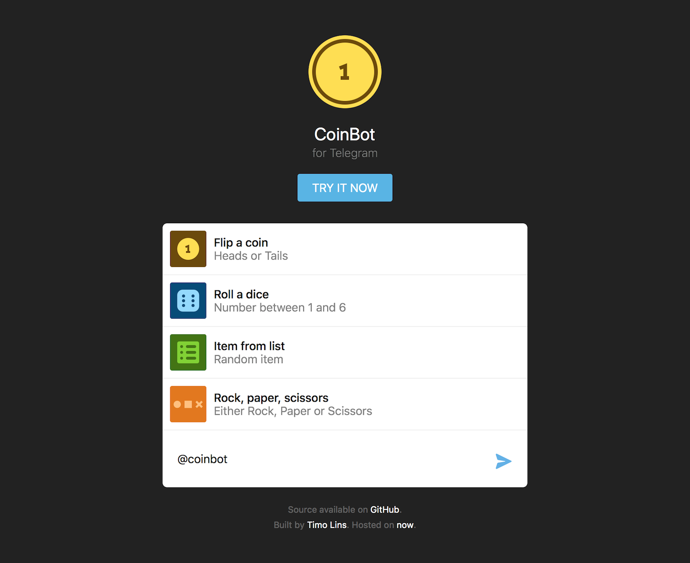

Your colleges and you want to get something to eat, but you can't decide on where to go? Why not fire up [_@CoinBot_](https://telegram.me/coinbot) inside your Telegram chat and let it decide.

CoinBot is an [open-source](https://github.com/timolins/coinbot) bot for the [Telegram Messenger](https://telegram.org/) which helps you (or a group) make random decisions. It supports multiple modes, like rolling dice or choosing a random item from a list.

_Screenshot of the [CoinBot website](http://coinbot.timo.sh)_

### Motivation

The idea was born from the exact scenario described at the beginning. Since the concept itself was simple, I hopped right into my editor and built a working version of the bot within a few minutes. At this point I thought it would make a cool **open-source** project, so why not extend it with a few more features.

There isn't much else to the project than generating random values in a few different ways, so I thought to myself: Why not use this chance to focus on **code quality**, **structure** and **modularity**. And so I did – because who knows if I ever will work on such a simple but useful project again.

All commands are **modular** and use the same definition scheme. This structure makes it possible to add new commands by adding a single file – they will work in inline & chat mode, and even the [website](http://coinbot.timo.sh) updates according to the same files.

I used [Telegraf](https://telegraf.js.org/) for the bot itself and [Next.js](https://github.com/zeit/next.js) for the website. Both were a pleasure to work with.
