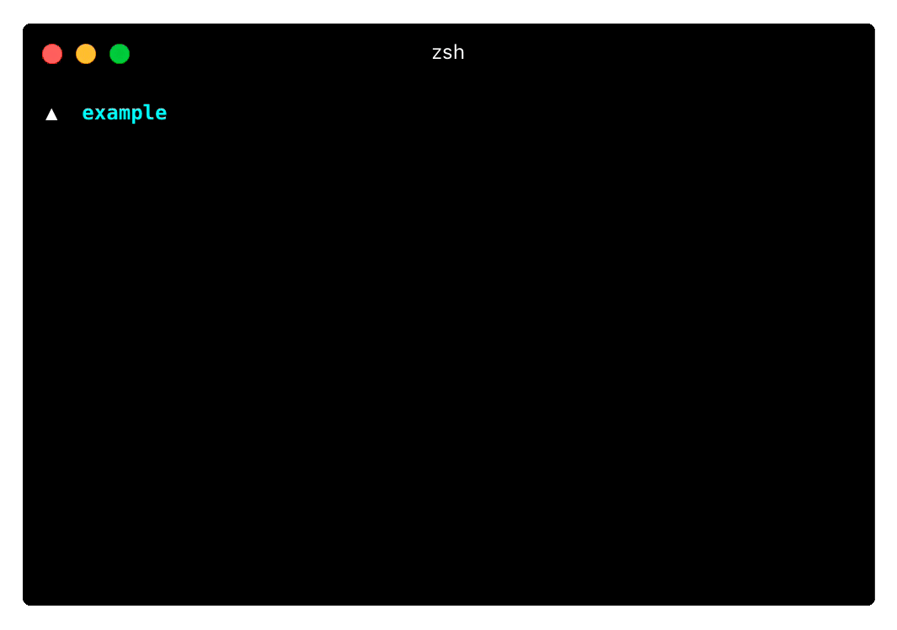

Reproducing your preferred panel arrangement inside your terminal can be time-consuming. Not only that – it's **repetitive work**, the archenemy of every programmer.

Introducing [hyperlayout](https://github.com/timolins/hyperlayout), a configurable & command-triggered layout tool for [Hyper™](https://hyper.is/). It works globally or on a per-project basis.

_Example usage of hyperlayout_

### Motivation

While developing [owe.zone](/owezone) I found it bothersome to start working on it because I had to:

* Start the MongoDB instance
* Start gulp to watch & compile
* Start the API itself
* Start the Next.js front-end
* Leave two panels empty to run commands in – all in the right directory

I was using Hyper, which is known to be **extensible** to the core – so I why not build a plugin which does all the work for me.

The task turned out harder than expected. The main hurdle was the algorithm, which converts the config file into a queue of commands so Hyper can execute them and yield the correct layout.

It took three days and a lot of coffee to get the first version [released](https://www.npmjs.com/package/hyperlayout). Since then [hundreds of developers](https://npm-stat.com/charts.html?package=hyperlayout) have downloaded hyperlayout.
