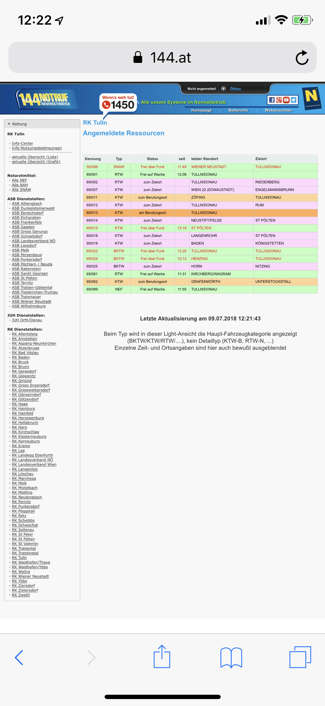

[Kreuz Apps](https://kreuz.co) is a collection of apps and service for paramedics working at the [Austrian Red Cross](https://www.roteskreuz.at/).

_[kreuz.co](https://kreuz.co) – The Kreuz Apps website to access the tools_

It contains three services

* An **auto-updating** [calendar subscription](https://kreuz.co/dienstplan) for your **roster**
* A **real-time map** to view all vehicles from your department
* A [Telegram Bot](https://kreuz.co/tracker/) to keep **track** of your **overtime** & tips

### Motivation

I was born in Austria 🇦🇹, where every male citizen above the age of 18 gets to "choose" between serving the military for six months or work for an [alternative civilian service](https://en.wikipedia.org/wiki/Alternative_civilian_service) organization for nine months. The military isn't for me, so I decided on **joining the Austrian Red Cross** to spend my time on something meaningful.

#### Roster Calendar Subscription

When I started to work at the Red Cross, I expected to get a printed version of my roster every month. Our **service times were different almost every day**, so I hoped for a way to **look them up on my phone** – to my surprise, they already had an app to check your service times. Kudos to them at this point. But things weren't perfect – for one, it wasn't adapted for the iPhone X, which is just a minor thing, but still worth to note (Hey, even Google managed to [update Inbox](https://www.theverge.com/2018/7/5/17537576/google-update-inbox-email-app-apple-iphone-x-gmail) at this point).
But the following two points broke the experience for me:

* **Downtimes** occurred every second day or so, which made it impossible to look up your schedule (no offline support either).
* Listed **events weren't chronological**. Some of my colleges didn't show up on time for that reason.

At this point, it was clear that things needed to be fixed. The app was using an _App Token_ to authenticate with your account, which made it relatively simple to reverse engineer. With a bit of research, I built a small microservice, which fetched the current roster and converted it into the subscribable `.ics` format.

Now it was possible to add it to almost every calendar software. This brought some significant benefits with it:

* All events were stored **offline** on the device – no more downtimes
* **Cross-platform** – Synced perfectly with my Mac, iPhone and Apple Watch
* Integrated natively – this enabled the **calendar widget** and **Siri**

#### Live Map

During a day at work, it was always nice to keep an eye on other crews and their location + status. This allowed us to plan our rides more efficiently. Sadly the only way to do so was via [a website](https://www.144.at/webansicht/) that looked like it came straight from 2007. It already had a map view built-in, but it wasn't optimized for mobile devices which made it impossible to zoom.

  

    
  

_[144.at](https://www.144.at/webansicht/) – The website that is used to monitor Red Cross units in Lower Austria_

To fix this, I built a Node.js service which exposes a real-time socket with location and status information about every crew from your department. It polls the data from the website and diffs it against its current state. Once it detects a change, the new state gets pushed to all connected clients.

The information was most relevant on the go – so a mobile app would suit the needs perfectly. With the help of [React Native](https://facebook.github.io/react-native/), I built an application to monitor the status and location of all vehicles in real-time.

  

    <video loop autoplay src="./assets/kreuz-live-map.mp4"></video>
  

#### Overtime Tracker

On some days it just **wasn't possible to go home on time** due to a long-distance transport or an unpredictable event. Our service leader told us to keep track of those overtimes so that we can get the time back on another day. To make this as easy as possible, I wrote a Telegram bot to track them within seconds. Tip tracking was also added to the mix, to get some cool stats afterward.

#### Kreuz Website

All those tools worked great for me – why not share them with all other paramedics in Austria? To make them accessible, I bought the domain [_kreuz.co_](https://kreuz.co) which offered and explained all the tools mentioned above – packaged neatly into a website.
