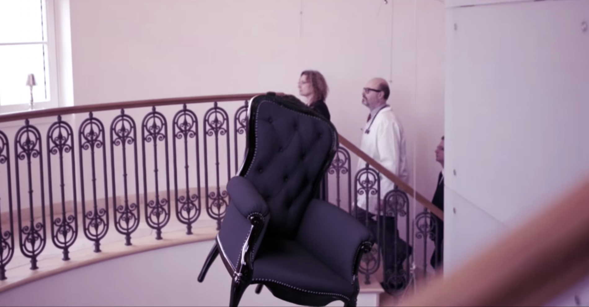

As part of a school project, we got the opportunity to produce a music video for a song of our choice. [Andreas](https://rippl.at), [Can](https://twitter.com/candenzer), [Julian](https://twitter.com/julianmeninger) and I grouped up and decided on the track _Lüge der Medien_ by the german rapper _LGoony_.

  <iframe src="https://www.youtube.com/embed/PnhMXjSavpc?showinfo=0&rel=0" allowfullscreen></iframe>

### Background

The whole movie was on an Sony α7S mounted on a DJI Ronin-M. I used Final Cut Pro X for the cut as well as for the grading.

_[01:35](https://youtu.be/PnhMXjSavpc?t=95) – Floating objects were made with Cinema 4D and a 360° camera_

For the CGI we used a 360° camera to capture an HDR image of each scene to match the lighting as closly as possible.
