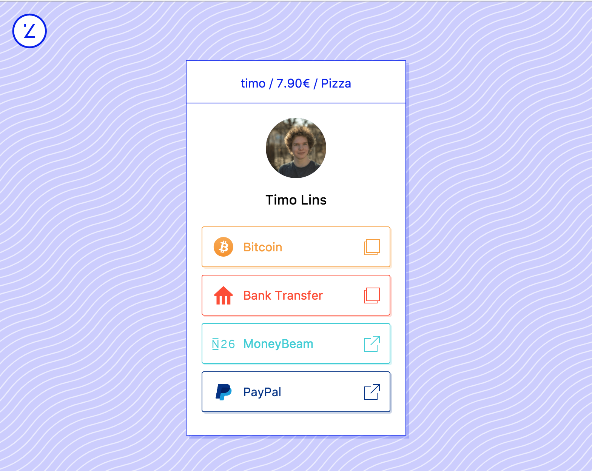
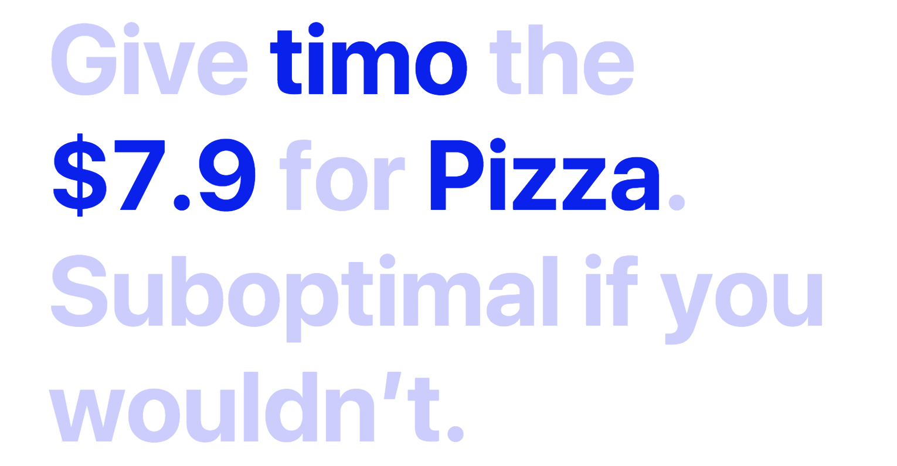
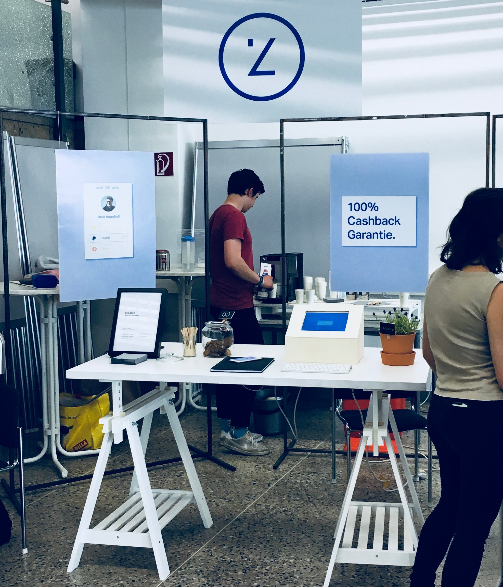
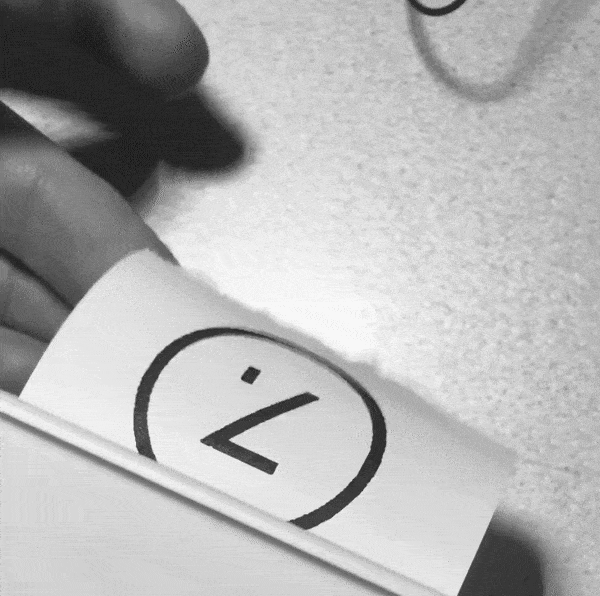

> **Holiday Group**

> You: _Hey folks! Y'all still **owe me \$7.9** for the pizza we had last week. 🍕_
>
> Jake: _Hit me with your **PayPal**_!
>
> Marie: _What was your **Venmo** username again? 💸_
>
> Andi: _Are you cool with **cash**?_

Agreeing on a payment method while **splitting a bill shouldn't be hard**. Sure, there are a lot of services out there that try to solve this problem, like Cash App or paypal.me. All of these work great by themselves, but they can't help if someone doesn't use this particular service.

> You: _Here you go: [owe.zone/timo/7.9/Pizza](https://owe.zone/timo/7.9/Pizza)_

Why not **combine all those services** into one personal link? That's where [**owe.zone**](https://owe.zone) comes in. Share your link to present all your payment providers in one place – append the amount and a name to it, to tell the other person what it's all about.

_Screenshot of my owe.zone page_

### Background

The project came together as part of my diploma project, joined by [Leo](https://leomuehlfeld.at/) and [Andi](https://rippl.at). We worked on owe.zone for about nine months (next to school, of course), which included an in-depth brand study, the design, and development process.

#### Dynamic quotes

Finance isn't the most casual topic around – that's why we decided to loosen things up with some sassy quotes.

_One of the many possible quotes_

All of them adapt to the URL, to make sure there's always a pleasant surprise when you visit an owe.zone link.

#### The booth

For the presentation of the project, we built an interactive booth where people could reserve their username. It also helped to grow our mailing list for the release.

_Preparing our booth for the visitors_

After someone made a successful reservation, the printer below the table starts printing a custom confirmation to take home.

#### Project status

Unfortunately, owe.zone isn't open to the public yet. Selected users are already able to use owe.zone, but the management interface is still unpolished. Sadly this won't change any time soon since my focus is on other projects at the moment. We will see what the future will bring – I would love to get owe.zone released.
