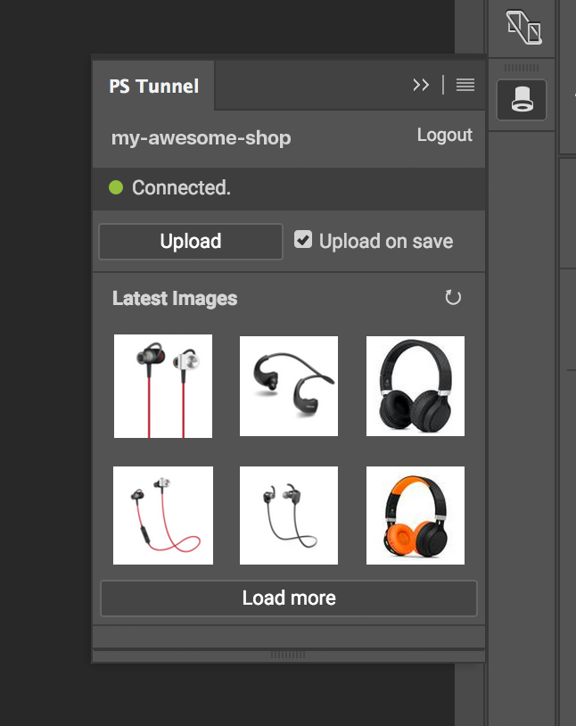

[PS Tunnel](https://apps.shopify.com/photoshop-tunnel) is an app for **Shopify** & **Photoshop** which enables you to **edit images** from your product catalog in Photoshop without the hassle. **With one click**, the selected image will open up in Photoshop. Once you are happy with your changes, hit save and PS Tunnel will replace the old image with the new one!

  <iframe src="https://www.youtube.com/embed/MH6YCUzOW2I?showinfo=0&rel=0" allowfullscreen></iframe>

_The PS Tunnel promotion video. Made by the awesome [Leo Mühlfeld](https://leomuehlfeld.at)._

### Motivation

Back in High School, some of my friends used to run Shopify stores. One of them complained about how painful it was to edit a large number of images from your store.

- You had to **find the image** in your store
- Click on it & **download it**
- **Open** it in Photoshop
- Make your changes
- **Save** the new image
- **Remove** the old image
- **Update** the new image
- Repeat

That's a considerable amount of work for a straightforward task. And that's exactly the reason why I built PS Tunnel.

_The Photoshop Extension for PS Tunnel_

 

The back-end was built with [Koa](https://koajs.com/), and React is powering the Photoshop extension.

The service has been **in production** since January 2017, and has paying customers ever since. I have received a lot of [positive feedback](https://apps.shopify.com/photoshop-tunnel#reviews) and ideas during this time, which is why I'm currently working on the next generation of PS Tunnel.

### The Brand

[Vanilla Supply](https://vanilla.supply) is the company I created to publish PS Tunnel. I have plans to extend the scope to even more e-commerce apps and services.

_The logo for Vanilla Supply_

One of my goals is to make the Vanilla Supply website much more advance, to keep all my customer up-to-date. Currently, email is my only communication channel, which isn't best for this use-case. A blog with updates now and then would be a much better fit.
