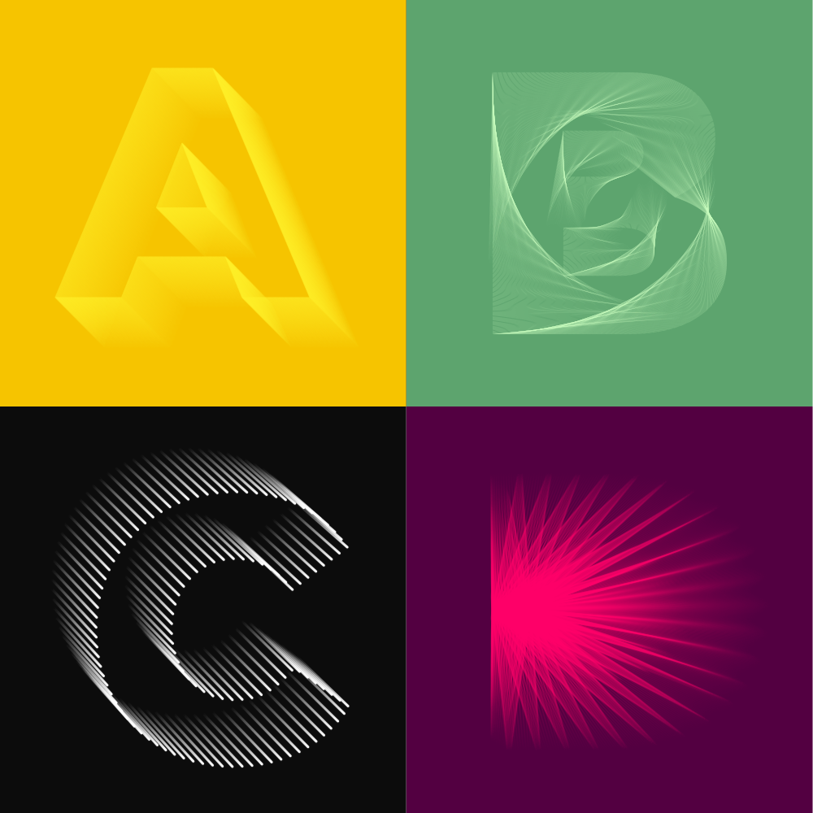
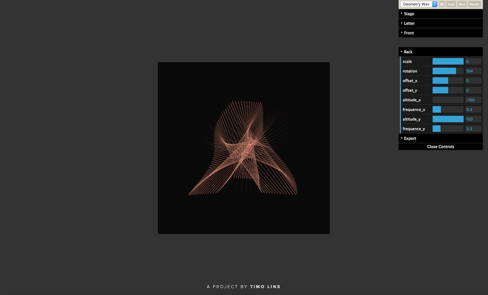

Create unique letter designs with [**Rihlinator**](https://rihlinator.timo.sh). Play with all the settings to make your very own creations.

### Motivation

Back at [die Graphische](http://www.graphische.net) we had a lesson where we got the task to illustrate each letter of the alphabet with one artistic style. But as it turned out, the course was just about doing something different every week or so. This was a lot of work – especially for the folks that took photographs of each letter.

  

That's why I came up with this tool, so I could easily present different design every week. And it worked! At the end of the year I just settled with one design, exported the whole alphabet, and I was good to go. [Try it out yourself!](https://rihlinator.timo.sh)
