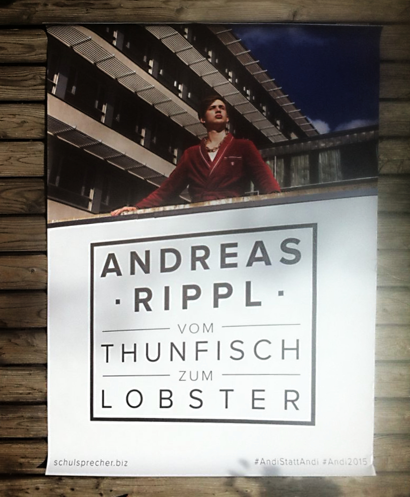
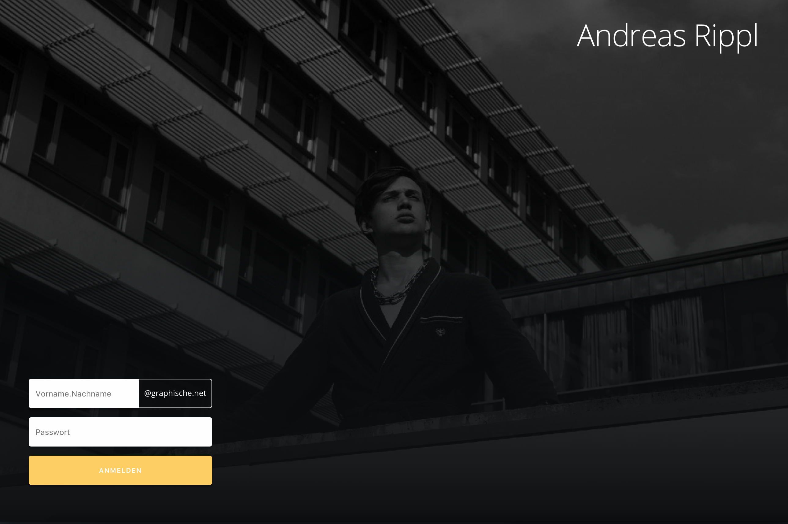
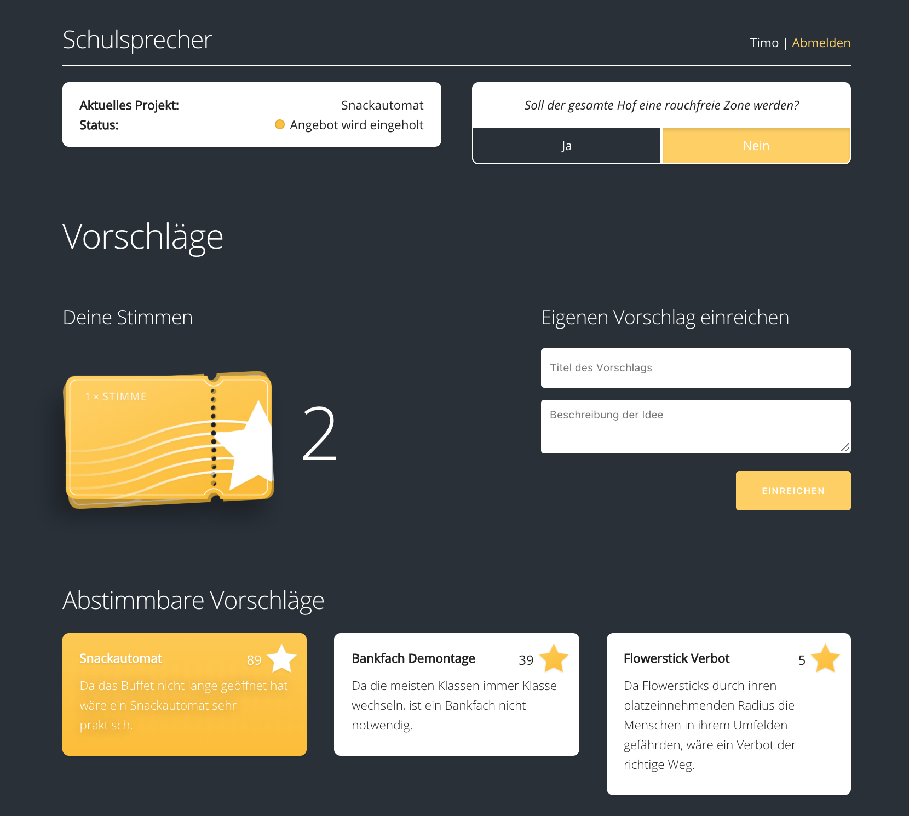

In 4th grade at [my high school](https://www.graphische.net), [Andreas Rippl](https://rippl.at) decided to run as the student representative for our school. His predecessors hardly made any difference, which is why we teamed up and decided to take it in our hands and make a positive impact.

It was a two-step plan. At first, we needed to **make him win**, so he is in the position to make a difference. Secondly, what are we even trying to achieve? The other candidates always had one or two things they wanted to change, but we aimed to do things differently. We wanted to give the students the power to decide on what to change about our school – that's why I wanted to build **a platform for all students**, to suggest and vote for changes they desire.

### Win the election

Andreas was our class representative the year before. This position was rather meaningless in the previous years, which is why our class started to joke around and exaggerate it. That led us to pretend that he's some kind of king figure.

We ended up using his satirical image for his school-wide election campaign. I produced a short teaser video, to get his name out on social media.

  <iframe src="https://www.youtube.com/embed/Slsiv5nPgbk?showinfo=0&rel=0" allowfullscreen></iframe>

We also designed & printed out a couple of A0 sized posters, which were hung up all around school.

 
_One of the posters for the pre-election_

The domain _schulsprecher.biz_ pointed to the video at the time of the election – later on, it was used for the voting platform.

One day after the election, Andreas was called to the principal's office. They told him that **he won the election**!

### The Platform

Now that he was indeed our school representative, I had to get to work and make the promised platform happen.

To make it as good as possible, I spent a lot of time on that project for two weeks. [Meteor](https://meteor.com) helped to make it come to life within that time frame. Its real-time capabilities were also a nice bonus.

_The landing page – everyone with a school email address could sign up_

After logging in, you were able to take participate in the current **poll**, submit or **vote for suggestions** and see the projects Andreas is working on. This way all students were able to **share their ideas**, and get information about the current progress. Even if something wasn't possible to achieve, the students got to know why that's the case.

All that collected data could be managed and viewed from the admin panel. Every time Andreas went to a meeting with the school principal, he was able to show the importance of his demands by stating the numbers.

The platform was a great success and helped the students to get their wishes heard.
